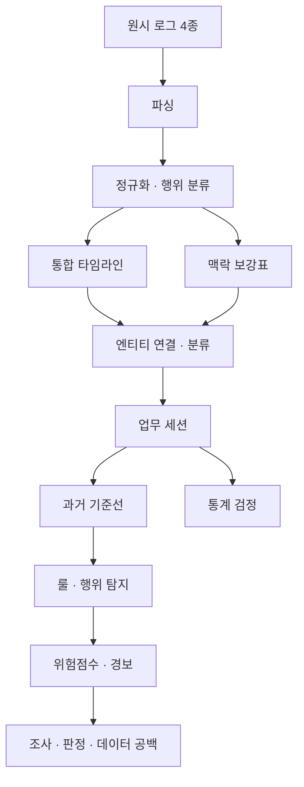

# 보안 로그 교차 분석

테이렌 제공 보안 로그 4종(sshd · nginx · sysmon · audit)을 파싱·정규화하고, 세션·시스템 활동의 맥락과 탐지 신호를 결합해 조사 우선순위를 정한다. 데이터 분석팀이 입력·코드·산출물을 함께 확인하는 저장소다.

## 먼저 찾기

| 찾는 정보 | 바로가기 |
|---|---|
| 데이터 파일·행 수·컬럼·연결 키 | [데이터 목록](data/README.md) |
| 파일을 생성한 코드·실행 순서 | [스크립트 목록](scripts/README.md) |
| 분석 규칙·결정 근거·결과·한계 | [분석 문서](docs/README.md) |
| 환경 설치·전체 재실행 | [실행 가이드](docs/09_실행_가이드.md) |
| Snowflake 파싱·정규화 | [SQL 안내](sql/snow/README.md) |
| 분석 결과 그래프 | [그래프 목록](assets/analysis/README.md) |

## 전체 흐름



## 단계별 입력 → 코드 → 산출물

폴더 링크를 열면 파일별 설명과 컬럼 목록을 확인할 수 있다. 정규화의 두 버전 중 다음 분석 단계에서는 `*_normalized_event_action.csv`를 사용한다.

| 단계 | 입력 데이터 | 실행 코드 | 산출 데이터 | 상세 설명 |
|---|---|---|---|---|
| 원시 로그 | Snowflake 제공 로그 | 기업 제공 원본 | [01_raw](data/01_raw) | [처리 기준](docs/02_데이터_구조.md) |
| 파싱 | [01_raw](data/01_raw) | [01_parse_audit.py](scripts/01_parse_audit.py)<br>[01_parse_nginx.py](scripts/01_parse_nginx.py)<br>[01_parse_sshd.py](scripts/01_parse_sshd.py)<br>[01_parse_sysmon.py](scripts/01_parse_sysmon.py) | [02_parsed](data/02_parsed) | [처리 기준](docs/03_파싱_정규화.md) |
| 정규화·행위 분류 | [01_raw](data/01_raw)<br>[02_parsed](data/02_parsed) | [02_normalize_audit.py](scripts/02_normalize_audit.py)<br>[02_normalize_nginx.py](scripts/02_normalize_nginx.py)<br>[02_normalize_sshd.py](scripts/02_normalize_sshd.py)<br>[02_normalize_sysmon.py](scripts/02_normalize_sysmon.py)<br>[03_apply_event_action.py](scripts/03_apply_event_action.py) | [03_normalized](data/03_normalized) | [처리 기준](docs/03_파싱_정규화.md) |
| 타임라인 통합 | [03_normalized](data/03_normalized) | [04_integrate.py](scripts/04_integrate.py) | [04_integrated](data/04_integrated) | [처리 기준](docs/04_통합_보강_연결.md) |
| 맥락 보강 | [03_normalized](data/03_normalized) | [05_enrich.py](scripts/05_enrich.py) | [05_enriched](data/05_enriched) | [처리 기준](docs/04_통합_보강_연결.md) |
| 엔티티 연결·분류 | [04_integrated](data/04_integrated)<br>[05_enriched](data/05_enriched) | [06_link_classify.py](scripts/06_link_classify.py) | [06_classified](data/06_classified) | [처리 기준](docs/04_통합_보강_연결.md) |
| 세션화 | [06_classified](data/06_classified) | [07_sessionize.py](scripts/07_sessionize.py) | [07_sessions](data/07_sessions) | [처리 기준](docs/05_세션화_기준선.md) |
| 기준선 | [07_sessions](data/07_sessions)<br>[05_enriched](data/05_enriched) | [08_baseline.py](scripts/08_baseline.py) | [08_baseline](data/08_baseline) | [처리 기준](docs/05_세션화_기준선.md) |
| 탐지 | [07_sessions](data/07_sessions)<br>[08_baseline](data/08_baseline)<br>[05_enriched](data/05_enriched) | [09_detect.py](scripts/09_detect.py) | [09_detections](data/09_detections) | [처리 기준](docs/06_탐지_위험점수.md) |
| 위험점수·경보 | [09_detections](data/09_detections)<br>[07_sessions](data/07_sessions)<br>[05_enriched](data/05_enriched)<br>[08_baseline](data/08_baseline) | [10_risk.py](scripts/10_risk.py) | [10_risk](data/10_risk) | [처리 기준](docs/06_탐지_위험점수.md) |
| 조사 | [10_risk](data/10_risk)<br>[09_detections](data/09_detections)<br>[08_baseline](data/08_baseline)<br>[07_sessions](data/07_sessions)<br>[05_enriched](data/05_enriched) | [11_investigate.py](scripts/11_investigate.py) | [11_investigation](data/11_investigation) | [처리 기준](docs/07_조사_결과.md) |
| 통계 검정 | [07_sessions](data/07_sessions) | [12_stat_tests.py](scripts/12_stat_tests.py) | [12_stats](data/12_stats) | [처리 기준](docs/08_통계검정.md) |

## 현재 데이터와 결과

- 원시 로그: sshd 1,364건 · nginx 2,223건 · sysmon 5,082건 · audit 456건.
- 전체 단계 CSV 45개. 통합 이벤트 9,125건 → 업무 세션 146개 → 탐지 신호 76건 → 경보 세션 4개.
- 원시·중간·최종 데이터를 함께 보관한다. 제공 데이터는 합성 가능성이 있으며 운영 데이터로 확정하지 않는다.
- 경보는 조사 대상 선정 결과다. 공격 성공·유출 성공이나 탐지 정확도를 의미하지 않는다.

## 실행

```bash
python -m pip install -r requirements.txt
python scripts/run_all.py
```

`run_all.py`는 파싱·초기 정규화와 그 검증까지만 실행한다. 통합부터 조사·통계 검정까지의 전체 순서는 [실행 가이드](docs/09_실행_가이드.md)에 있다. 재실행하면 해당 단계의 산출 CSV를 덮어쓴다.

## 대시보드

[dashboard_v2](dashboard_v2)는 `data/`의 분석 결과 CSV 26개를 읽어 보여주는 Streamlit 앱이다. 탐지·점수·판정을 다시 계산하지 않으므로 수치를 바꾸려면 해당 분석 단계를 재실행해 CSV를 갱신한다.

```bash
python -m streamlit run dashboard_v2/app.py   # 저장소 최상위에서 실행
python scripts/99_verify_dashboard_v2.py      # 수정 후 화면·집계값 검증
```

| 수정 대상 | 파일 |
|---|---|
| 화면 6개 | [dashboard_v2/views](dashboard_v2/views) |
| 공통 카드·표·차트 | [components.py](dashboard_v2/components.py) |
| CSV 경로·읽기 | [loaders.py](dashboard_v2/loaders.py) |
| 색·글꼴 | [theme.py](dashboard_v2/theme.py), [.streamlit/config.toml](.streamlit/config.toml) |
| 로고 | [assets](dashboard_v2/assets) (`make_logo.py` 재생성 시 Pillow 필요) |

대시보드 수정은 `main`에 바로 올리지 않고 브랜치를 만들어 Pull Request로 공유한다.

```bash
git switch -c dashboard/<작업내용>
# 수정 → 로컬 실행·검증
git push -u origin dashboard/<작업내용>   # GitHub에서 Pull Request 생성
```

## 팀 작업 규칙

- 원시 로그는 보존하고 변경 근거는 문서에 남긴다.
- 데이터 의미·컬럼·경로가 바뀌면 해당 폴더 README와 코드 설명을 함께 갱신한다.
- 코드 또는 상위 입력 변경 시 영향받는 다음 단계를 재실행하고 결과 변경을 확인한다.
- 사실·추정·모름을 구분하며 서로 다른 계정 체계를 이름만으로 연결하지 않는다.
