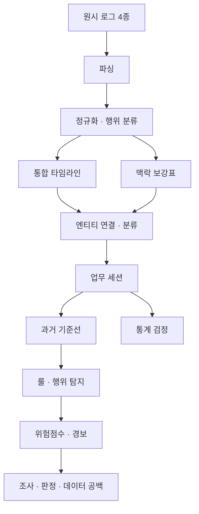

# 분석 흐름

```mermaid
flowchart TD
    R[원시 로그 4종] --> P[파싱]
    P --> N[정규화 · 행위 분류]
    N --> I[통합 타임라인]
    N --> E[맥락 보강표]
    I --> C[엔티티 연결 · 분류]
    E --> C
    C --> S[업무 세션]
    S --> B[과거 기준선]
    B --> D[룰 · 행위 탐지]
    D --> K[위험점수 · 경보]
    K --> Q[조사 · 판정 · 데이터 공백]
    S --> T[통계 검정]
```

세부 입력 의존성은 [전체 연결표](../../README.md)와 [스크립트 설명](../../scripts/README.md)을 참고한다.
